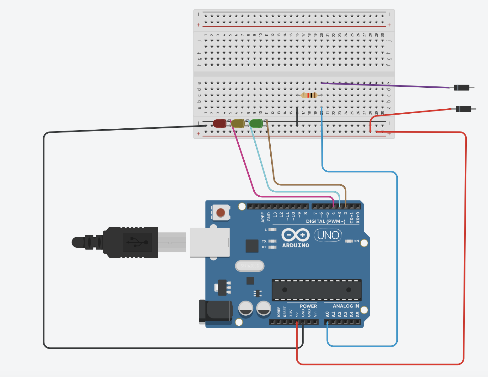
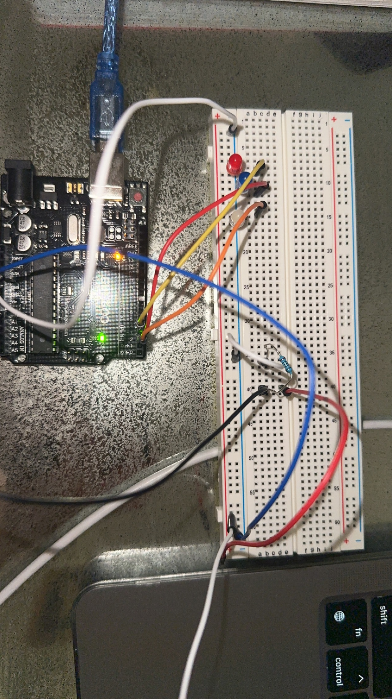
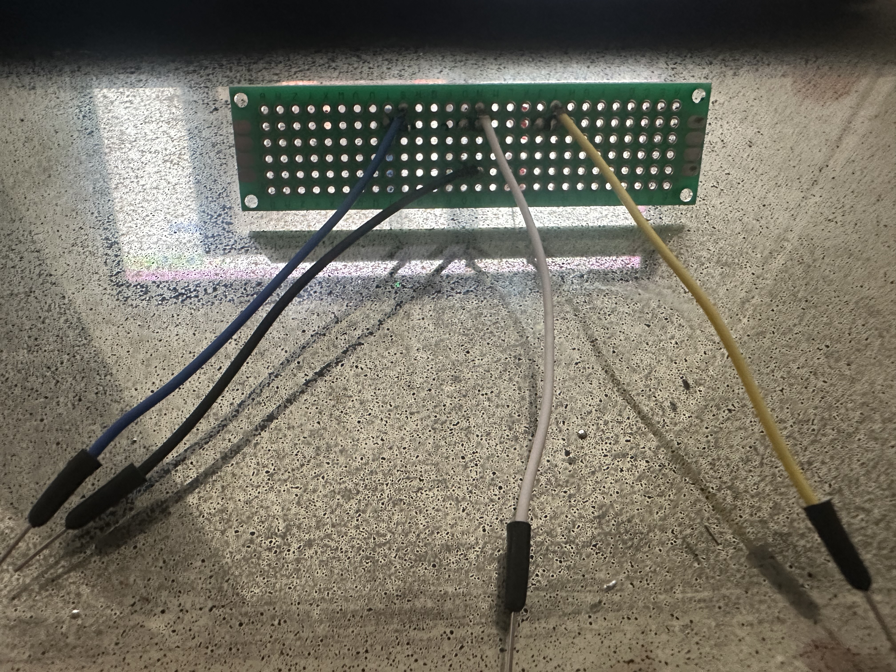
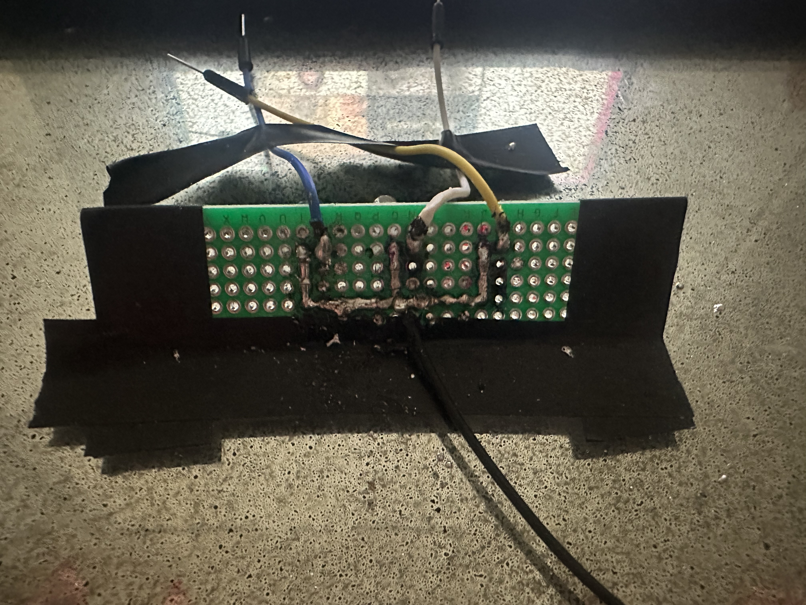

# Lie Detector 
Were you ever in a situation where you wanted to know if your friend was lying to you? Well in this project, we can determine just that by measuring the change in someone's skin conductivity depending on their mood. 

```HTML 
<!--- This is an HTML comment in Markdown -->
<!--- Anything between these symbols will not render on the published site -->
```

| **Engineer** | **School** | **Area of Interest** | **Grade** |
|:--:|:--:|:--:|:--:|
| Tsheyang L | Fiorello H. Laguardia High shcool | Computer Science | Incoming Senior
.jpg) 
  
# Final Milestone

<iframe width="560" height="315" src="https://www.youtube.com/embed/D9mpzIhttk4" title="YouTube video player" frameborder="0" allow="accelerometer; autoplay; clipboard-write; encrypted-media; gyroscope; picture-in-picture; web-share" allowfullscreen></iframe>

For my final milestone, I soldered the Led lights and added a 10 k potentiometer to change the sensitivity. Then I added a lid, with a hole so the led lights can poke out. Something I struggled with was trying to solder my Led lights, because the wires would randomly fall off and my iron wouldn't let me melt the solder properly, but after a lot of tries I ended up getting that done. Overall at bluestamp, I learned the basics of breadboarding and how to solder. In the future, I hope to create more projects and gain more soldering practice.


# Second Milestone

<iframe width="560" height="315" src="https://www.youtube.com/embed/PkrtjiQfmDU" title="YouTube video player" frameborder="0" allow="accelerometer; autoplay; clipboard-write; encrypted-media; gyroscope; picture-in-picture; web-share" allowfullscreen></iframe>

For my second milestone, I stripped the two wires and used aluminum foil and velcro to make the finger straps, and I made a box for my arduino and breadboard out of cardboard. I added two holes for the finger straps to go through and for the wire to be able to connect to my computer. For now, we can determine if someone was lying based on the serial plotter. It indirectly measures the person's skin conductivity shown on a graph by outputting a voltage dependent on the skin conductivity which will help identify when the data changes its pattern. If the pattern changes, then it means the person was lying. A struggle I am currently facing is trying to get my Led lights to turn on. Which is what I am going to fix for milestone 3. I am gonna try changing the size of my resistor to change the sensitivity (adding a potentiometer will let the user vary the resistance in real time) and I am also adding a battery pack so I don’t have to keep my lie detector connected to my computer. 


# First Milestone

<iframe width="560" height="315" src="https://www.youtube.com/embed/t69B1PQtK7U" title="YouTube video player" frameborder="0" allow="accelerometer; autoplay; clipboard-write; encrypted-media; gyroscope; picture-in-picture; web-share" allowfullscreen></iframe>

My first milestone was to wire up my breadboard to have the three LED lights turn on when the red and white wires touch each other. I connected my Arduino UNO to my breadboard and downloaded my code for it. I also added a 2K resistor to divide the current. I struggled at first trying to learn the basics of breadboarding, so I watched many videos. The resistor would also not stay in place, which made it difficult to work all together. But after many adjustments, I got it to work! For the next Milestone I am going to create the finger straps for the two wires and build it a home using cardboard.


# Schematics 




.jpeg)

# Code

```Arduino
void setup() {
  Serial.begin(9600);
  pinMode(2, OUTPUT);
  pinMode(3, OUTPUT);
  pinMode(4, OUTPUT);
  digitalWrite(2, HIGH);
  delay(500);
  digitalWrite(3, HIGH);
  delay(500);
  digitalWrite(4, HIGH);
  delay(500);
}

void loop() {
   if (analogRead(A0) > 60)
{
  digitalWrite(4, HIGH);
}
else
{
  digitalWrite(4, LOW);
}
  if (analogRead(A0) > 45)
{
  digitalWrite(2, HIGH);
}
else
{
  digitalWrite(2, LOW);
}
  if (analogRead(A0) > 0)
{
  digitalWrite(3, HIGH);
}
else
{
  digitalWrite(3 , LOW);
}

  
  Serial.println(analogRead(A0));
  delay(20);
}
```

# Materials

| **Part** | **Note** | **Price** | **Link** |
|:--:|:--:|:--:|:--:|
| Arduino UNO | Controller board  | $28.99 | <a href="https://www.amazon.com/Arduino-A000066-ARDUINO-UNO-R3/dp/B[008GRTSV6/"> Link </a> |
| LED lights | Soldering | $2.99 | <a href="https://www.banggood.com/200Pcs-3MM-LED-Light-Assorted-Kit-Red-Green-Blue-Yellow-White-DIY-LEDs-Set-p-1018612.html?p=3S161310753936201705&cur_warehouse=CN/"> Link </a> |
| Jumper wires | connection wires | $6.98 | <a href="https://www.amazon.com/Elegoo-EL-CP-004-Multicolored-Breadboard-arduino/dp/B01EV70C78)/"> Link </a> |
| potentiometer | to change the sensitivity | $11.99 | <a href="https://www.amazon.com/Swpeet-Potentiometer-Assortment-Multiturn-HighPrecision/dp/B07ZKK6T8S/ref=sr_1_1_sspacrid=3U5FBULMX91HC&keywords=potentiometer%2Bkit&qid=1691786783&sprefix=potentiometer%2Bkit%2Caps%2C86&sr=8-1-spons&sp_csd=d2lkZ2V0TmFtZT1zcF9hdGY&th=1/"> Link </a> |
| Resistor | egulates the flow of electrical current  | $5.99 | <a href="https://www.amazon.com/MCIGICM-Values-Resistor-Assortment-Resistors/dp/B06WRQS97C/ref=sr_1_4?keywords=resistor&qid=1691787431&sr=8-4/"> Link </a> |
| Tin foil  | finger straps | $4.78 | <a href="https://www.amazon.com/Reynolds-Wrap-Heavy-Aluminum-Square/dp/B0014D0TB2/ref=sr_1_2_sspa?crid=UUODJH4VSJ25&keywords=tin+foil&qid=1691787565&sprefix=tin+foil%2Caps%2C113&sr=8-2-spons&sp_csd=d2lkZ2V0TmFtZT1zcF9hdGY&psc=1/"> Link </a> |
| Velcro| finger straps | $15.79 | <a href="https://www.amazon.com/Sticky-Fastener-Adhesive-Crafting-Organization/dp/B08KP577YY/ref=sr_1_1_sspa?crid=316TJ4DQA33OJ&keywords=velcro&qid=1691787730&sprefix=velcro%2Caps%2C134&sr=8-1-spons&sp_csd=d2lkZ2V0TmFtZT1zcF9hdGY&th=1/"> Link </a> |
| Cardboard | housing | $21.95 | <a href="https://www.amazon.com/Corrugated-Cardboard-Packaging-Gift-Boutique/dp/B08JQQ8TRJ/ref=sr_1_1_sspa?crid=3VZ8S8TRMR21E&keywords=cardboard&qid=1691787959&sprefix=cardb%2Caps%2C121&sr=8-1-spons&sp_csd=d2lkZ2V0TmFtZT1zcF9hdGY&psc=1/"> Link </a> |
| Hot Glue | To keep items in place | $17.99 | <a href="https://www.amazon.com/Gorilla-8401509-Hot-Glue-Sticks/dp/B07K791YRP/ref=sr_1_6?crid=17NBOA7WEMV7T&keywords=hot%2Bglue%2Bgun&qid=1691788018&sprefix=hot%2Bglue%2B%2Caps%2C100&sr=8-6&th=1/"> Link </a> |


# Tools

| **Part** | **Price** | **Link** |
|:--:|:--:|:--:|
| Soldering Kit | $17.99 | <a href="https://www.amazon.com/Soldering-Iron-Kit-Temperature-Desoldering/dp/B07S61WT16/"> Link </a> |
| wire strippers | $6.99 | <a href="https://www.amazon.com/gp/product/B097STWW4Q/ref=ox_sc_act_title_1?smid=AZ0MMPOLVYF3T&psc=1/"> Link </a> |
